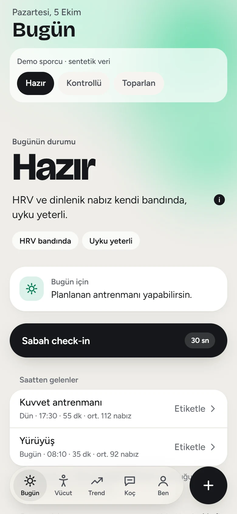
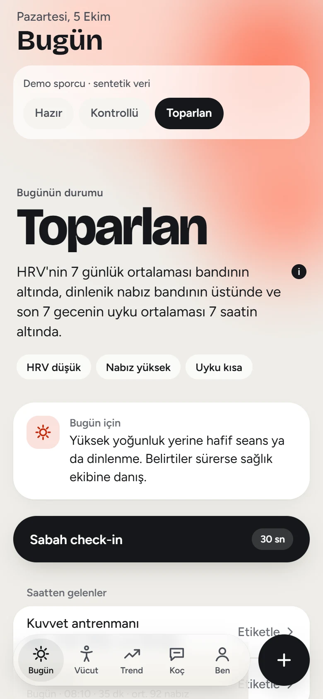
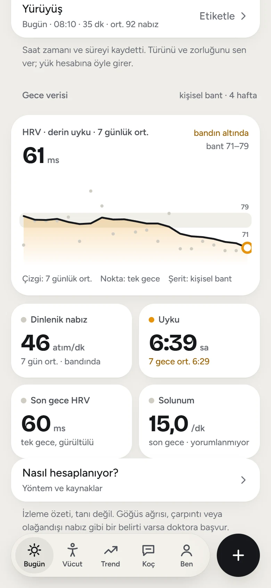
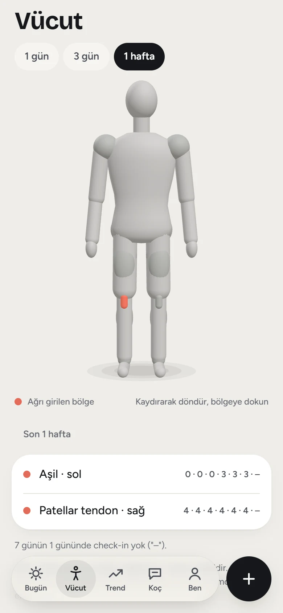

# HoopLab

> **In English.** HoopLab is a personal iPhone app (Expo + Supabase) that a professional basketball player is building for personal use. It reads wearable data from the Google Health API and the athlete's own daily inputs. Each value is compared with the athlete's **own baseline**, not with general-population norms. Numbers come from a deterministic, tested engine. Every threshold links to a verified scientific source (DOI/PMID). An AI model will only *explain* numbers the engine has already computed; it never calculates them. The repo also keeps the whole development record: decision records, session reports, lessons learned and a privacy guard that scans every commit and the full git history. The documentation is in Turkish. The app has an offline **demo mode** with a synthetic athlete, so no account is needed to look around. To run it with your own Supabase and Google Cloud accounts, `npm run setup` installs and checks the server side ([guide, Turkish](docs/guides/kurulum.md)).

Profesyonel bir basketbolcunun kendi antrenmanı için geliştirdiği iPhone uygulaması. Fitbit Air / Google Health verisini ve sporcunun kendi girdilerini birleştirir. Değerleri sedanter popülasyon normlarına göre değil, **sporcunun kendi baseline'ına** göre değerlendirir.

> Durum: **Faz 1 (temel uygulama) sürüyor.** Canlı durum: [docs/STATE.md](docs/STATE.md) · Ürün tanımı: [docs/PRODUCT.md](docs/PRODUCT.md) · Yol haritası: [docs/ROADMAP.md](docs/ROADMAP.md)

<p align="center">
  <picture><source media="(prefers-color-scheme: dark)" srcset="docs/gorseller/bugun-hazir-dark.webp"></picture>
  <picture><source media="(prefers-color-scheme: dark)" srcset="docs/gorseller/bugun-toparlan-dark.webp"></picture>
  <picture><source media="(prefers-color-scheme: dark)" srcset="docs/gorseller/gece-verisi-dark.webp"></picture>
  <picture><source media="(prefers-color-scheme: dark)" srcset="docs/gorseller/vucut-dark.webp"></picture>
</p>
<p align="center"><sub>Demo modu, sentetik sporcu verisi. Soldan: günün durumu Hazır ve Toparlan, gece verisi, haftalık ağrı haritası.</sub></p>

## Neden

Giyilebilir cihazların yorumları ortalama bir kullanıcıya göre ayarlı. Profesyonel bir sporcunun değerleri bu çerçevede yanlış okunur. Çok düşük dinlenik nabız, yüksek haftalık yük ve uzun toparlanma ihtiyacı buna örnektir. Cihaz bazı şeyleri hiç ölçemez: seansın ne kadar zorladığı, hangi kasın ağrıdığı, maç takvimi. HoopLab bu boşluğu doldurmayı hedefliyor. Uygulama sporcunun kendi geçmişine bakar, eksik bilgiyi kısa girdilerle sporcudan alır ve her yorumu bir bilimsel kaynağa bağlar.

## Şu an ne yapıyor

- **Google Health senkronu:** Saatlik çalışır. Gece HRV'si, dinlenik nabız, SpO2, solunum hızı, cilt sıcaklığı, adım ve kalori, uyku ve egzersiz oturumları günlük özet olarak alınır. Gün içi ham nabız hiç saklanmaz.
- **Toparlanma:** HRV, dinlenik nabız ve uyku, son 7 günün önceki 4 haftaya göre kişisel bandıyla (± 0,5 SD) karşılaştırılır. Sonuç günün durumu olarak gösterilir: *Hazır*, *Kontrollü*, *Toparlan* veya veri yetmiyorsa *Bant oluşuyor*. Hesabın nasıl yapıldığı uygulamada ayrı bir ekranda anlatılır.
- **Sabah check-in:** Beş madde 1-5 ölçeğiyle girilir: uyku kalitesi, yorgunluk, kas ağrısı, stres, ruh hali. Yanına sol / sağ ağrı haritası (0-10) eklenir. Hedef süre 30 saniye.
- **Seans kaydı ve etiketleme:** Saatin kaydettiği oturum seans kaydına bağlanır. Tür (maç, takım antrenmanı, şut, kuvvet...) ve RPE sporcudan gelir. Seans yükü RPE × dakika olarak hesaplanır.
- **Vücut görünümü:** Döndürülebilir 3D mankende ağrı haritası 1 gün, 3 gün veya 1 hafta için gösterilir.
- **Demo modu:** Sentetik bir sporcuyla bütün ekranlar gezilebilir. Sunucuya bağlanmaz.

Sıradakiler: antrenman yükü (akut / kronik), kas ve tendon yorgunluğu tahmini, beslenme ve hidrasyon hedefleri (Faz 2), kaynak gösteren AI koç (Faz 3).

## İlkeler

```
Google Health API ─┐
Sporcu girdileri ──┴─> Veri (Supabase) ─> Hesap motoru ─> Kanıt tabanı ─> AI yorum ─> iPhone (Expo)
                                          (deterministik,   (her eşik bir    (yalnız hesaplanmış
                                           testli TS)        kaynağa bağlı)   değerler + kaynaklar)
```

- **Sayıları kod hesaplar, AI hesaplamaz.** Hesaplar [packages/engine](packages/engine) içinde deterministik ve testlidir. Dil modeli yalnız hesaplanmış değerleri ve ilgili kanıtları yorumlar.
- **Her eşik bir kaynağa bağlıdır.** Uygulamadaki her sayısal eşik [research/rules](research/rules) içinde tanımlıdır ve [research/sources](research/sources) içindeki bir kaynağa işaret eder. Kaynaklar DOI veya PMID ile doğrulanır ve geri çekilme kontrolünden geçer ([research/](research/README.md)). Doğrulanamayan kaynak eklenmez.
- **Kişisel baseline önce gelir.** Popülasyon referansı yalnız sporculara özgü bir kaynak varsa kullanılır.
- **Tahmin, tahmin olarak etiketlenir.** Örneğin günün durumundaki birleşim HoopLab'in kendi sentezidir, doğrulanmış bir skor değildir. Uygulama da öyle sunar.
- **Tıbbi sınır:** Uygulama teşhis koymaz. Kırmızı bayraklarda yorum yapmaz, doktora yönlendirir.

## Nasıl geliştiriliyor

HoopLab, sporcunun [Claude Code](https://claude.com/claude-code) ile birlikte yürüttüğü bir proje. Süreç repoda açık duruyor:

- **Kararlar:** Her mimari ve ürün kararı seçenekleri ve gerekçesiyle kayda geçer ([docs/decisions/](docs/decisions/README.md)).
- **Oturum raporları:** Her çalışma oturumunda ne yapıldığı, neyin bozulduğu ve ne öğrenildiği yazılır ([docs/sessions/](docs/sessions/README.md)).
- **Dersler:** Bilinen tuzaklar `[ölçüldü]` / `[doğrulanacak]` etiketiyle tutulur ([docs/LESSONS.md](docs/LESSONS.md)).
- **Tek doğruluk kaynağı:** [docs/STATE.md](docs/STATE.md). Her oturum oradan başlar ve orayı güncelleyerek biter. Çalışma kuralları [CLAUDE.md](CLAUDE.md) içinde.
- **Otomatik denetim:** Her push'ta tip denetimi, testler, gizlilik taraması ve kaynak doğrulaması çalışır ([.github/workflows](.github/workflows/checks.yml)). Haftalık bir denetim ve aylık bir literatür taraması da var.

## Gizlilik

Bu repo kod ve süreç içerir; **kişisel veri içermez.** Sağlık verisi yalnız sahibin Supabase projesinde ve repo dışındaki bir klasörde durur ([0005](docs/decisions/0005-repo-ve-gizlilik-ayrimi.md)). Hangi verinin nerede durduğu ve hangi servise ne gittiği [docs/DATA-INVENTORY.md](docs/DATA-INVENTORY.md) içinde yazılı.

- Her commit'ten önce [gizlilik bekçisi](tools/guard/privacy-guard.mjs) çalışır. Dosyalarda ve commit mesajında sır kalıplarını, veri dosyalarını ve repo dışında tutulan kişisel ifadeleri arar. Push'ta ve CI'da aynı tarama tüm git geçmişi üzerinde tekrarlanır: her dosya sürümü, her commit mesajı ve her yazar satırı. Bekçi fail-closed yazıldı ve negatif testlerle kanıtlandı.
- Veritabanında her tablo tek sahibe kilitlidir (RLS, pgTAP testli). Google ve Claude API sırları yalnız sunucu tarafındaki Edge Functions'ta durur, uygulamaya girmez.
- Ekran görüntüleri, demo ve testler yalnız sentetik veriyle yapılır.

## Hızlı deneme

Node.js 22+ ve iPhone'da Expo Go gerekir.

```bash
npm install
npm run mobile
```

QR kodunu iPhone kamerasıyla okutun ve giriş ekranında **Demoyu aç**'a dokunun. Demo için Supabase bağlantısı gerekmez. Web önizlemesi için `npm run web -w @hooplab/mobile` çalıştırılır. Gerçek veriyle kendi Supabase ve Google Cloud hesaplarınla kurmak için: `npm run setup`. Sihirbaz sunucu tarafını kurar ve senin konsolda yapacağın birkaç adımı numaralı listeler; `npm run setup:check` hiçbir şeyi değiştirmeden denetler. Adım adım: [docs/guides/kurulum.md](docs/guides/kurulum.md) ([0009](docs/decisions/0009-herkes-kendi-hesabiyla.md), [0023](docs/decisions/0023-kurulum-sihirbazi-terminalde.md)).

```bash
npm run hooks:install   # yeni klonda bir kez: git hook'larını etkinleştirir
npm run check           # tip denetimi, testler, gizlilik taraması, kaynak doğrulama
```

## Yığın ve yapı

Expo SDK 57 (React Native, TypeScript strict, Expo Router) · Supabase (Postgres + RLS, Auth, Edge Functions, pg_cron; Frankfurt) · Google Health API v4 · Claude API (yalnız sunucu tarafında, Faz 3) · three.js (3D manken)

```
apps/mobile/       Expo uygulaması
packages/engine/   hesap motoru: ölçekler, seans yükü, toparlanma bandı (saf TS, testli)
packages/theme/    tasarım token'ları (renk, tipografi, hareket)
supabase/          migration'lar, RLS testleri, Edge Functions (Google Health bağlantısı ve senkron)
research/          kanıt tabanı: doğrulanmış kaynaklar, kurallar, literatür takibi
docs/              geliştirme arşivi: durum, kararlar, oturum raporları, dersler
design/            tasarım yönü maketleri (sentetik veri)
tools/             gizlilik bekçisi, kaynak doğrulayıcı, yedek ve Claude Code hook'ları
.claude/           Claude Code komutları (/ac, /rep, /kapat) ve skill'ler
```

## Lisans

Kod [MIT](LICENSE) lisanslıdır. Üçüncü taraf parçalar kendi lisanslarıyla gelir: [.claude/skills/THIRD_PARTY_NOTICES.md](.claude/skills/THIRD_PARTY_NOTICES.md) (MIT) ve [Bricolage Grotesque kesimi](packages/theme/fonts/OFL.txt) (SIL OFL 1.1). Kaynak özetleri kendi cümlelerimizle yazılmıştır. Makalelerin telif hakkı yayıncılarına aittir.

**Uyarı:** Bu uygulama tıbbi bir cihaz değildir ve tıbbi tavsiye vermez.
